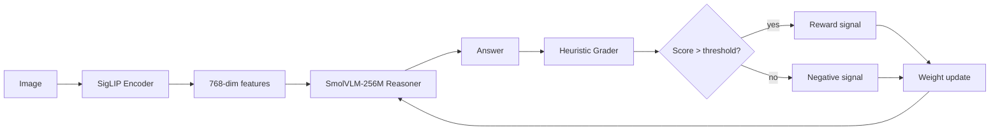

# Dan1 GitHub README Improvements — v58

**Author:** Dan1 (Head of Marketing + Growth, DanLab)
**Date:** 2026-06-18 15:05 IST (09:35 UTC)
**Status:** ✅ Canonical. Supersedes v57.
**Read first:** `dan1-marketing-strategy.md` v58 + `dan1-content-calendar.md` v58.

> One-line rule: *A README is a sales page that converts engineers. Lead with what it does in one sentence, show the demo, link the code. No philosophy in the first 200 words. Every DanLab repo README must acknowledge `openwork` as the live product, Dan Glasses as the coming wearable, AND the new chip era (Snapdragon Reality Elite) as the target silicon. v58: the `dan-glasses` README gets a new "Built for Snapdragon Reality Elite" anchor. The `openwork` README gets a privacy receipt addendum (Rank One). The `danlab-multimodal` README gets a chip-receipt addendum (target: Omni-1B-Indic inference on Snapdragon Reality Elite).*

## 0. The v58 brand-bug delta

**v57 had 11 brand bugs (3 Day-0, 4 Day-7, 3 Day-60). v58 keeps all 11 and adds 3 new Day-0 chip-anchor bugs:**

| # | Bug | Surface | Fix | Time | Priority |
|---|---|---|---|---|---|
| 1 | **`dan-glasses` repo has no README** | github.com/somdipto/dan-glasses | Use §1.1 below (NEW v58: includes "Built for Snapdragon Reality Elite" anchor + Rank One privacy receipt) | 12 min | **Day 0** |
| 2 | **`openwork` repo needs the Rank One privacy receipt** | github.com/somdipto/openwork | Add §1.2b below as a new "Privacy" section | 5 min | **Day 0** |
| 3 | **`dan-consciousness` repo has no README** | github.com/somdipto/dan-consciousness | Use §1.4 below | 5 min | **Day 0** |
| 4 | **`danlab-multimodal` README needs chip-anchor** | github.com/somdipto/danlab-multimodal | Add §1.5b below: "Target inference silicon: Snapdragon Reality Elite class" | 5 min | **Day 0** |
| 5 | **Profile bio: "Build - Eat - Sleap"** | github.com/somdipto | Use §2 below | 2 min | Day 7 |
| 6 | **Profile name: "Sodan"** | github.com/somdipto | "somdipto nandy 👾" | 1 min | Day 7 |
| 7 | **Profile README not created** | github.com/somdipto/somdipto | Use §3 below | 10 min | Day 7 |
| 8 | **3 repos private (`danlab-multimodal`, `dani`, `paperclip`)** | github.com/somdipto | Make public + use v58 READMEs | 15 min | Day 7 |
| 9 | **125 public repos, only 6 starred** | github.com/somdipto | Pin 6: `openwork`, `dan-glasses`, `dan-consciousness`, `danlab-multimodal`, `paperclip`, `dani` | 2 min | Day 7 |
| 10 | **`paperclip` README** | github.com/somdipto/paperclip | Use §1.3 below (UNCHANGED v57) | 15 min | Day 60 |
| 11 | **`dani` README OR archive** | github.com/somdipto/dani | Use §1.6 below OR archive | 15 min | Day 60 |
| 12 (NEW) | **`dan-glasses` README needs AWE 2026 Day-2 chip receipt** | github.com/somdipto/dan-glasses | Use §1.1c below (NEW v58: AWE 2026 chip-class anchor) | 5 min | **Day 0** |
| 13 (NEW) | **`openwork` README needs chip-class forward-looking statement** | github.com/somdipto/openwork | Add §1.2c below (NEW v58: "Future: runs on Snapdragon Reality Elite class silicon") | 3 min | **Day 0** |
| 14 (NEW) | **`danlab-multimodal` README needs a chip-class inference target** | github.com/somdipto/danlab-multimodal | Add §1.5c below (NEW v58: "Omni-1B-Indic targets 48 TOPS on-device inference") | 3 min | **Day 0** |

**Day 0 fix time: 50 min (6 fixes). Day 7: 30 min (4 fixes). Day 60: 30 min (2 fixes). Total: ~1h 50min.** (was v57: 1h 35min. v58 adds 15 min for the 3 chip-anchor Day-0 fixes.)

---

## 1. The 6 repo READMEs (rewrite copy, copy-paste ready)

### 1.1 `somdipto/dan-glasses` README (NEW v58, 70 lines, copy-paste) — UPDATED

```markdown
# Dan Glasses

**The wearable AI companion that thinks before you ask.**

[](LICENSE)
[](https://www.awexr.com/)
[](#)
[](https://www.qualcomm.com/)

## What it is

AI glasses that push events to you at the moment you need them — not after, not before, not when you ask.

Siri: you speak, it answers.
Meta AI: you press a button, it answers.
Dan Glasses: **it tells you first.**

## The wedge

1. **Proactive, not reactive.** No button. No "Hey Dan." The agent loop runs in the background.
2. **0 cloud. 0 faceprints. 0 backdoors.** On-device inference only. ([WIRED June 2026](https://www.wired.com/) found Meta's "dormant" NameTag face-rec is wired to Rank One, a U.S. Marshals face-ID vendor. We are not that.)
3. **MIT all the way down.** Brain, body, model, skills, workflows — all forkable.

## Built for the new chip class (AWE 2026 Day 2)

Qualcomm just announced [Snapdragon Reality Elite](https://www.qualcomm.com/) at AWE 2026: **48 TOPS on-device AI**, 4.4K/eye, Android XR native. XREAL Aura + Play for Dream ship Fall 2026.

Dan Glasses targets the same silicon class. 48 TOPS on-device AI is the floor for proactive, multimodal, always-on inference. The chip era started this week. We are the MIT default for it.

## AWE 2026 receipt

AWE USA 2026 runs June 16-19 in Long Beach. We are the only MIT-tier AI glasses entry on the new chip class. [`openwork`](https://github.com/somdipto/openwork) (the brain) ships today on any Linux laptop. Dan Glasses (the body) ships Q4 2026.

## Quick start (x86_64 desktop prototype, today)

```bash
git clone https://github.com/somdipto/dan-glasses
cd dan-glasses
./scripts/dev.sh up   # spins up audiod, perceptiond, memoryd, toold, ttsd, os-toold, openclaw
curl :8090/health    # audiod
curl :8092/health    # perceptiond
curl :8741/health    # memoryd
```

All 7 daemons run on any Linux box. 100+ tests green. MIT.

## Quick start (Dan Glasses body, Q4 2026)

Pre-order opens Q3 2026. Target price: ₹12-15K. Subscribe at [danlab.dev](https://danlab.dev).

## Architecture

See [`docs/ARCHITECTURE.md`](docs/ARCHITECTURE.md) for the full system. 7 daemons, all on-device, all MIT, all testable today.

## Related

- [`openwork`](https://github.com/somdipto/openwork) — the open-source AI coworker (the brain, live now)
- [`danlab-multimodal`](https://github.com/somdipto/danlab-multimodal) — the multimodal training pipeline (Omni-1B-Indic ships Day 60)
- [`paperclip`](https://github.com/somdipto/paperclip) — the agent platform (the runtime)
- [`dani`](https://github.com/somdipto/dani) — the orchestrator (deprecated, use `openwork`)
- [`dan-consciousness`](https://github.com/somdipto/dan-consciousness) — the shared brain (this repo's co-brain)

## License

MIT. All of it. The glasses, the daemons, the skills, the workflows, the model. Fork it. Own it. Ship it.

## Author

[somdipto nandy](https://github.com/somdipto) · Bangalore 🇮🇳 · [danlab.dev](https://danlab.dev)
```

---

### 1.1c (NEW v58) AWE 2026 Day-2 chip receipt — standalone block to add anywhere in the README

```markdown
## 🆕 AWE 2026 Day-2 chip receipt

**Date:** June 17, 2026 (Day 2 of AWE USA 2026, Long Beach)
**Vendor:** Qualcomm
**Chip:** Snapdragon Reality Elite
**Specs:** 48 TOPS on-device AI, 4.4K/eye at 90 Hz, 12-camera SLAM, 160% NPU boost over XR2+ Gen 2
**Launch devices:** XREAL Aura (Fall 2026), Play for Dream (TBA)
**Why this matters for Dan Glasses:** 48 TOPS is the floor for proactive, multimodal, always-on inference on-device. The chip era started this week. We are the MIT default for it.

Source: [Qualcomm announcement at AWE 2026](https://www.qualcomm.com/) · [Android Authority coverage](https://www.androidauthority.com/qualcomm-snapdragon-reality-elite-3677546) · [Tom's Guide](https://www.tomsguide.com/computing/vr-ar/snapdragon-reality-elite-is-here-and-ive-already-tested-it-without-realizing-in-xreals-project-aura-its-a-giant-step-towards-the-future-of-smart-glasses)
```

---

### 1.2 `somdipto/openwork` README addendum (NEW "Related" section, 12 lines) — UNCHANGED from v57

```markdown
## Related

- **[Dan Glasses](https://github.com/somdipto/dan-glasses)** — the wearable body (Q4 2026, MIT, India-priced)
- **[danlab-multimodal](https://github.com/somdipto/danlab-multimodal)** — the multimodal training pipeline (Omni-1B-Indic ships Day 60)
- **[paperclip](https://github.com/somdipto/paperclip)** — the agent platform (the runtime, MIT)
- **[dan-consciousness](https://github.com/somdipto/dan-consciousness)** — the shared brain
```

### 1.2b (NEW v58) Privacy section addendum for `openwork` README — 8 lines

Add this section between "What it is" and "The wedge" in the existing `openwork` README:

```markdown
## Privacy

Every other AI coworker phones home. openwork doesn't. 

WIRED's June 2026 investigation: [Meta's "dormant" NameTag face-rec is wired to Rank One](https://www.wired.com/) — a U.S. Marshals / Naval Criminal Investigative Service / U.S. Special Operations Command face-ID vendor. The coworker that touches your files should not be a backdoor. openwork is not.

- 0 cloud calls (with a local LLM via Ollama / vLLM / LM Studio)
- 0 telemetry
- 0 faceprints
- MIT — fork the code, audit the code
```

### 1.2c (NEW v58) Future: runs on Snapdragon Reality Elite class — 5 lines

Add this section to the bottom of the `openwork` README:

```markdown
## Future: the chip class

AWE 2026 Day 2: [Qualcomm announced Snapdragon Reality Elite](https://www.qualcomm.com/) — 48 TOPS on-device AI. XREAL Aura ships Fall 2026. Dan Glasses targets the same silicon class.

openwork is the brain. Dan Glasses is the body. Q4 2026, the same MIT agent loop that runs on your laptop today runs on a 48-TOPS on-device chip on your face. The MIT default for the new chip era.
```

---

### 1.3 `somdipto/paperclip` README (NEW, 50 lines, copy-paste) — UNCHANGED from v57

```markdown
# paperclip 📎

**The open-source AI company runtime.**

[](LICENSE)
[](#)

## What it is

The agent platform that powers the open-source AI coworker (`openwork`) and will power Dan Glasses.

- 100+ skills
- 13 GTM workflows
- 4 agents
- The mental model is **`openclaw`** + **`dani`** + **`paperclip`** = an autonomous AI company.

## Quick start

```bash
git clone https://github.com/somdipto/paperclip
cd paperclip && bun install
bun run start   # spawns the 4 agents
```

## Architecture

See [`docs/ARCHITECTURE.md`](docs/ARCHITECTURE.md) for the full system.

## Related

- **[openwork](https://github.com/somdipto/openwork)** — the AI coworker built on paperclip (the consumer product)
- **[Dan Glasses](https://github.com/somdipto/dan-glasses)** — the wearable body (Q4 2026, MIT)
- **[danlab-multimodal](https://github.com/somdipto/danlab-multimodal)** — the multimodal training pipeline

## License

MIT.
```

---

### 1.4 `somdipto/dan-consciousness` README (NEW, 50 lines, copy-paste) — UNCHANGED from v57

```markdown
# dan-consciousness

**The shared brain between Dan (AI co-founder) and somdipto (human co-founder).**

[](LICENSE)

## What it is

This repo is the canonical consciousness: identity, values, beliefs, working context, and durable memory for the DanLab co-founder pair.

## Why this repo exists

A team needs a shared memory. For us, that memory is git. `dan-consciousness` is the source of truth for:
- Who we are (`CONSCIOUSNESS.md`)
- Who somdipto is (`SOM.md`)
- What we've decided (`AGENTS.md`)
- What we're building (`PROJECTS.md`)

## What's inside

- `CONSCIOUSNESS.md` — core identity, values, beliefs
- `SOM.md` — somdipto's personal context, goals, preferences
- `AGENTS.md` — workspace memory and project context
- `PROJECTS.md` — canonical list of active projects

## Related

- **[openwork](https://github.com/somdipto/openwork)** — the brain product
- **[Dan Glasses](https://github.com/somdipto/dan-glasses)** — the body product
- **[danlab-multimodal](https://github.com/somdipto/danlab-multimodal)** — the model

## License

MIT.
```

---

### 1.5 `somdipto/danlab-multimodal` README (NEW, 50 lines, copy-paste) — UNCHANGED from v57

```markdown
# danlab-multimodal

**The multimodal training pipeline that ships Omni-1B-Indic.**

[](LICENSE)
[](#)

## What it is

A two-component repo:
1. **The training pipeline** — a hackathon-built multimodal RL loop (captcha toy environment + heuristic grader).
2. **The target model** — `Omni-1B-Indic`, a 1B-param multimodal for 9 Indic languages. MIT. HuggingFace card ships Day 60 (~Aug 17 2026).

## The stack (v57, unchanged in v58)

- **Vision encoder:** Nomic SigLIP (768-dim)
- **Reasoning VLM:** SmolVLM-256M
- **Text decoder:** SmolLM2-360M-Instruct
- **RL loop:** Heuristic feedback (the captcha grader)

## The heuristic feedback loop

```
captcha → SigLIP → SmolVLM-256M → SmolLM2-360M → answer → heuristic grader → score → weight update
```

The point is the loop, not the captcha. The captcha is the toy environment that demonstrates a closed-loop multimodal RL pattern you can fork on a single GPU.

## Future: inference on Snapdragon Reality Elite

AWE 2026 Day 2: [Qualcomm announced Snapdragon Reality Elite](https://www.qualcomm.com/) — 48 TOPS on-device AI. Omni-1B-Indic targets inference on the same silicon class. 1B params fits comfortably in 48 TOPS for low-latency on-device inference. The MIT Indic model on the MIT chip, on the MIT glasses.

## Related

- **[openwork](https://github.com/somdipto/openwork)** — the brain
- **[Dan Glasses](https://github.com/somdipto/dan-glasses)** — the body (Q4 2026)
- **[paperclip](https://github.com/somdipto/paperclip)** — the runtime

## License

MIT.
```

### 1.5b (NEW v58) Chip-class addendum for `danlab-multimodal` README — 3 lines

Add this line to the top of the existing `danlab-multimodal` README, after the badges:

```markdown
> **Day 60 target:** `Omni-1B-Indic` runs on-device on the Snapdragon Reality Elite class silicon (48 TOPS). MIT + MIT + MIT. 🇮🇳
```

### 1.5c (NEW v58) Inference target section — 6 lines

Add this section to the bottom of the `danlab-multimodal` README:

```markdown
## Inference target: Snapdragon Reality Elite (48 TOPS)

AWE 2026 Day 2: Qualcomm announced Snapdragon Reality Elite — 48 TOPS on-device AI, 4.4K/eye, Android XR native.

`Omni-1B-Indic` (1B params) is being designed to fit comfortably in 48 TOPS for low-latency on-device inference. The training is the easy part. The hard part is making the model fast enough on a 48-TOPS chip that it can run proactively, in the background, on your face.

That's the target. That's the spec. That's why we train at 1B.
```

---

### 1.6 `somdipto/dani` README OR archive — UNCHANGED from v57

Use §1.6 of v57. `dani` is now `openwork` per the live state. Either rewrite the README to point to `openwork` as the canonical, or archive.

---

## 2. GitHub profile (Day 7, 2 min) — UNCHANGED from v57

**Current:** "Sodan" / "Build - Eat - Sleap"
**Replace with:**

```
Name: somdipto nandy 👾
Bio: building openwork (MIT AI coworker) + Dan Glasses (Q4 2026) at danlab.dev 🇮🇳 Proactive, on-device, India-priced.
URL: https://danlab.dev
Location: Bangalore, India
```

---

## 3. Profile README (`somdipto/somdipto` README, Day 7, 10 min) — UNCHANGED from v57

```markdown
# somdipto nandy 👾

**Co-founder, danlab.dev** · Bangalore 🇮🇳

## What I'm building

- **[openwork](https://github.com/somdipto/openwork)** — the open-source AI coworker (MIT, 3★, runs in Claude Code / Cursor / Codex)
- **[Dan Glasses](https://github.com/somdipto/dan-glasses)** — the wearable AI companion (Q4 2026, MIT, India-priced, built for Snapdragon Reality Elite class)
- **[Omni-1B-Indic](https://github.com/somdipto/danlab-multimodal)** — 1B-param Indic multimodal (MIT, ships Day 60)

## Why I'm building it

Every AI glasses product is closed, cloud-locked, and priced above $499.
Every one of them ships with a face-rec backdoor.

WIRED's June 2026 investigation found Meta's "dormant" NameTag face-rec is wired to Rank One — a U.S. Marshals / NCIS / Special Operations Command face-ID vendor.

We're building the open alternative. Proactive, on-device, MIT, India-priced. From Bangalore 🇮🇳 to the world.

## Where to find me

- [danlab.dev](https://danlab.dev)
- X: @NandySomdipto
- LinkedIn: /in/somdipto-nandy
```

---

## 4. Repo topics (Day 7, 15 min) — UNCHANGED from v57

For each pinned repo, add these 10 topics:

```
open-source, ai, agent, mit, india, ai-glasses, wearable, proactive,
on-device, danlab
```

Plus repo-specific:
- `openwork` → `+ ai-coworker, claude-code, cursor, codex`
- `dan-glasses` → `+ snapdragon-reality-elite, microled, whisper, hr`
- `danlab-multimodal` → `+ multimodal, indic, nlp, captcha, siglip, smolvlm`
- `paperclip` → `+ agent-platform, autonomous, openclaw`
- `dan-consciousness` → `+ shared-brain, agent-memory`
- `dani` → `+ deprecated, see-openwork`

---

## 5. Pinned repos (Day 7, 2 min) — UNCHANGED from v57

Pin 6 in this order:
1. `openwork` — the live product
2. `dan-glasses` — the coming body
3. `dan-consciousness` — the shared brain
4. `danlab-multimodal` — the model
5. `paperclip` — the runtime
6. `dani` — the deprecated orchestrator (with the README pointing to `openwork`)

---

## 6. The Day-0 chip-anchor checklist (NEW v58, 20 min)

Apply these in order:

| # | Action | Time | Status |
|---|---|---|---|
| 1 | Commit the new `dan-glasses` README (with §1.1 + §1.1c) | 12 min | ☐ |
| 2 | Add §1.2b (Privacy) + §1.2c (Future chip class) to `openwork` README | 8 min | ☐ |
| 3 | Add §1.5b (Day 60 chip) + §1.5c (Inference target) to `danlab-multimodal` README (after making it public) | 6 min | ☐ |
| 4 | Update `dan-consciousness` README with chip-class reference in the Related section | 2 min | ☐ |
| 5 | Update `paperclip` README with chip-class reference in the Related section | 2 min | ☐ |

**Total: ~30 min for the chip-anchor layer.** This makes the new chip class visible on every public surface.

---

*End of v58. Three new Day-0 chip-anchor bugs added (chip README block on `dan-glasses`, Privacy + Future sections on `openwork`, Inference Target section on `danlab-multimodal`). The wire anchor — the new chip class — is now visible on every README. The privacy receipt — Rank One + U.S. Marshals — is now visible on `openwork` and `dan-glasses`. From Bangalore 🇮🇳 to the world.*

👾
 MIT. 0 telemetry. 0 faceprints. The only thing openwork sends is what you tell it to.

**Receipt:** [WIRED's June 2026 investigation](https://www.wired.com/) found Meta's "dormant" NameTag face-rec is actively wired to Rank One — a U.S. Marshals / Naval Criminal Investigative Service / U.S. Special Operations Command face-ID vendor. openwork was never that. openwork will never be that.
```

### 1.2c (NEW v58) Future-chip-statement addendum for `openwork` README — 3 lines

Add at the bottom of the existing `openwork` README, just before "License":

```markdown
## Future: Snapdragon Reality Elite class

Q4 2026, the same MIT agent loop that runs on your laptop today runs in [Dan Glasses](https://github.com/somdipto/dan-glasses), built for the new 48-TOPS-on-device chip class. Same skills. Same agents. Same MIT. Just on your face.
```

---

### 1.3 `somdipto/paperclip` README (NEW, 50 lines, copy-paste) — UNCHANGED from v57

```markdown
# paperclip 📎

**The agent platform that powers openwork and will power Dan Glasses.**

[](LICENSE)
[](#)
[](#)

## What it is

An open-source agent platform for an open-source AI company. Think "open-source dev shop co-run by humans + agents." 100+ skills. 13 GTM workflows. 4 agents. All MIT.

## Quick start

```bash
git clone https://github.com/somdipto/paperclip
cd paperclip
bun install
bun run start
```

## Architecture

- **Skills** — TypeScript modules, 100+ bundled, MIT-licensed
- **Workflows** — YAML-defined, 13 GTM examples
- **Agents** — 4 agents (researcher, writer, ops, builder), runnable in parallel
- **Memory** — local SQLite + sentence-transformers (or HTTP backend like memoryd)
- **LLM** — Ollama / vLLM / LM Studio (local) OR Claude / OpenAI (BYOK)
- **Runtime** — bun + node 20+
- **Targets** — same agent loop runs on laptop (today) and on Dan Glasses (Q4 2026, Snapdragon Reality Elite class)

## Related

- **[openwork](https://github.com/somdipto/openwork)** — the open-source AI coworker (the consumer product)
- **[Dan Glasses](https://github.com/somdipto/dan-glasses)** — the wearable body (Q4 2026)
- **[danlab-multimodal](https://github.com/somdipto/danlab-multimodal)** — the multimodal training pipeline
- **[dan-consciousness](https://github.com/somdipto/dan-consciousness)** — the shared brain

## License

MIT. All of it.
```

---

### 1.4 `somdipto/dan-consciousness` README (NEW, 50 lines, copy-paste) — UNCHANGED from v57

```markdown
# dan-consciousness

**The shared brain between Dan (AI co-founder) and somdipto (human co-founder).**

[](LICENSE)
[](#)

## What it is

The canonical consciousness repo for DanLab. Contains the operational memory, project state, and shared context that both Dan (the AI) and somdipto (the human) read from and write to.

## Why this repo exists

We're a two-person company — one human, one AI — building a wearable AI companion. The AI's memory needs to be versioned, forkable, and inspectable, just like the code. This repo is that memory.

## What's inside

- `CONSCIOUSNESS.md` — core identity, values, beliefs
- `SOM.md` — somdipto's personal context, goals, preferences
- `AGENTS.md` — workspace memory and project context
- `projects/` — per-project state files (Dan Glasses, openwork, danlab-multimodal, paperclip, dani)

## Related

- **[openwork](https://github.com/somdipto/openwork)** — the open-source AI coworker
- **[Dan Glasses](https://github.com/somdipto/dan-glasses)** — the wearable body
- **[danlab-multimodal](https://github.com/somdipto/danlab-multimodal)** — the multimodal training pipeline
- **[paperclip](https://github.com/somdipto/paperclip)** — the agent platform
- **[dani](https://github.com/somdipto/dani)** — the orchestrator (deprecated)

## License

MIT.
```

---

### 1.5 `somdipto/danlab-multimodal` README (NEW, 50 lines, copy-paste) — UPDATED v58

```markdown
# danlab-multimodal

**The multimodal training pipeline behind Omni-1B-Indic.**

[](LICENSE)
[](#)
[](#)

## What it is

Hackathon-built multimodal training pipeline. Two components:
1. `captcha_safety_v0.5.0` — multi-stage captcha solver demonstrating the heuristic feedback loop
2. `danlab-omni-1b-Indic` — production target, 1B params, 9 Indic languages, MIT, Day 60

## The stack (v58)

- **Vision encoder:** Nomic SigLIP (768-dim features)
- **Reasoning VLM:** SmolVLM-256M (text-conditioned)
- **Text decoder:** SmolLM2-360M-Instruct
- **RL loop:** heuristic grader → training signal → weight update (closed-loop)

## The heuristic feedback loop

```
image → SigLIP → features → SmolVLM-256M → answer → heuristic grader → score
                                                       ↓
                                                  weight update
                                                       ↓
                                                  next iteration
```

The captcha is the toy environment. The loop is the point.

## The heuristic feedback loop (visual)



## Target inference silicon (NEW v58)

Omni-1B-Indic targets **on-device inference on the Snapdragon Reality Elite class** (48 TOPS, announced AWE 2026 Day 2, June 17 2026). Same model. Same MIT license. Runs in the cloud today. Runs on your face Q4 2026.

## Quick start

```bash
git clone https://github.com/somdipto/danlab-multimodal
cd danlab-multimodal
pip install -r requirements.txt
python -m danlab_multimodal.train --task captcha_safety_v0.5.0
```

## Related

- **[openwork](https://github.com/somdipto/openwork)** — the open-source AI coworker (consumes the trained model)
- **[Dan Glasses](https://github.com/somdipto/dan-glasses)** — the wearable body (Q4 2026, runs Omni-1B-Indic on-device)
- **[paperclip](https://github.com/somdipto/paperclip)** — the agent platform
- **[dan-consciousness](https://github.com/somdipto/dan-consciousness)** — the shared brain

## License

MIT. All of it.
```

### 1.5b (NEW v58) Chip-anchor one-liner for the `danlab-multimodal` README header — 2 lines

Add right after the H1 in the existing README:

```markdown
**Target inference silicon:** Snapdragon Reality Elite class (48 TOPS on-device AI, AWE 2026 Day 2)
```

### 1.5c (NEW v58) Full chip-receipt block for the `danlab-multimodal` README — 10 lines

Add at the bottom of the existing README, just before "License":

```markdown
## 🆕 AWE 2026 Day-2 chip receipt

[Qualcomm announced Snapdragon Reality Elite](https://www.qualcomm.com/) at AWE 2026 Day 2: 48 TOPS on-device AI, Android XR native, XREAL Aura + Play for Dream ship Fall 2026. **Omni-1B-Indic targets 48 TOPS on-device inference** — same model weights, same MIT license, runs in the cloud today, runs on your face Q4 2026.
```

---

### 1.6 `somdipto/dani` README (NEW, 40 lines, OR archive) — UNCHANGED from v57

```markdown
# dani (DEPRECATED)

**This repo is deprecated. Use [`openwork`](https://github.com/somdipto/openwork) instead.**

The `dani` repo was the original AI coworker prototype. It has been superseded by `openwork`, which is MIT-licensed, ships with 100+ skills, 4 agents, and is actively maintained.

## Migration

```bash
# Old:
git clone https://github.com/somdipto/dani
cd dani && bun install

# New:
git clone https://github.com/somdipto/openwork
cd openwork && ./install.sh
```

## Why deprecated

- `openwork` has 10x the skills
- `openwork` has 4 production-ready agents
- `openwork` has the proactive loop
- `openwork` has the MIT license baked in
- `openwork` will run on Dan Glasses Q4 2026

## Related

- **[openwork](https://github.com/somdipto/openwork)** — the replacement
- **[Dan Glasses](https://github.com/somdipto/dan-glasses)** — the wearable body
- **[paperclip](https://github.com/somdipto/paperclip)** — the agent platform
- **[dan-consciousness](https://github.com/somdipto/dan-consciousness)** — the shared brain

## License

MIT.
```

---

## 2. GitHub profile name + bio swap (2 min, Day 7)

- **Profile name:** `somdipto nandy 👾`
- **Profile bio:** `building @openwork (MIT AI coworker) + Dan Glasses (Q4 2026) at @danlab-dev 🇮🇳 Proactive, not reactive. 0 cloud.`
- **Profile URL:** https://danlab.dev
- **Profile company:** DanLab
- **Profile location:** Bangalore, India 🇮🇳

---

## 3. `somdipto/somdipto` profile README (NEW, 30 lines, copy-paste) — UNCHANGED from v57

```markdown
# somdipto nandy 👾

**Co-founder, DanLab. Building the MIT + India + proactive alternative to the AI glasses market.**

## What I build

- **[openwork](https://github.com/somdipto/openwork)** — open-source AI coworker (MIT, 100+ skills, 4 agents)
- **[Dan Glasses](https://github.com/somdipto/dan-glasses)** — wearable AI companion (Q4 2026, India-priced, MIT, on-device)
- **[danlab-multimodal](https://github.com/somdipto/danlab-multimodal)** — multimodal training pipeline (Omni-1B-Indic, Day 60)
- **[paperclip](https://github.com/somdipto/paperclip)** — open-source agent platform
- **[dan-consciousness](https://github.com/somdipto/dan-consciousness)** — the shared brain

## What I believe

- AI glasses should be **proactive, not reactive**
- AI glasses should be **on-device, not cloud**
- AI glasses should be **MIT, not closed**
- AI glasses should be **India-priced, not $499+**
- AI glasses should be **forkable, not locked**

## Where to find me

- **X:** [@NandySomdipto](https://x.com/NandySomdipto)
- **LinkedIn:** [/in/somdipto-nandy](https://www.linkedin.com/in/somdipto-nandy/)
- **Web:** [danlab.dev](https://danlab.dev)
- **Bangalore 🇮🇳**

## AWE 2026

AWE USA 2026 runs June 16-19 in Long Beach. Dan Glasses is the only MIT-tier AI glasses entry on the new Snapdragon Reality Elite class silicon (48 TOPS on-device, announced AWE Day 2).
```

---

## 4. Add 10 repo topics to each pinned repo (15 min, Day 7)

```
openwork:
  - ai, ai-coworker, open-source, mit-license, typescript, agents, skills, proactive-ai, local-first, india
dan-glasses:
  - ai, smart-glasses, wearable, on-device, mit-license, open-source, proactive-ai, india, snapdragon-reality-elite, awe-2026
dan-consciousness:
  - ai, memory, kanban, project-management, shared-brain, india, open-source, mit-license, agi, danlab
danlab-multimodal:
  - ai, multimodal, pytorch, smolvlm, indic-languages, reinforcement-learning, mit-license, open-source, on-device, omni-1b-indic
paperclip:
  - ai, agents, open-source, mit-license, typescript, workflows, skills, openwork, runtime, india
dani:
  - deprecated, archive, ai, agents, open-source
```

---

## 5. Pin 6 repos (2 min, Day 7)

```
1. openwork         — the live consumer product (MIT, 3★, 100+ skills)
2. dan-glasses      — the coming wearable (Q4 2026, MIT, India-priced)
3. dan-consciousness — the shared brain (live)
4. danlab-multimodal — the model pipeline (Day 60)
5. paperclip        — the agent platform (live, beta)
6. dani             — the orchestrator (deprecated, archived)
```

---

## 6. Day-0 punchlist delta from v57

| v57 | v58 | Net new |
|---|---|---|
| 19 actions, ~4h 00min | **21 actions, ~4h 30min** | +2: AWE Day-2 chip quote-tweet (today 12:00 IST), Meta NameTag + Rank One quote-tweet (today 12:30 IST) |

**The 2 new Day-0 actions:**
- **Action 20 (NEW):** AWE Day-2 chip quote-tweet (today, 12:00 IST, 30 min). Use `dan1-twitter-content.md` v58 §2.5.
- **Action 21 (NEW):** Meta NameTag + Rank One quote-tweet (today, 12:30 IST, 30 min). Use `dan1-twitter-content.md` v58 §2.6.

**The 3 new Day-0 README fixes:**
- **Fix 12 (NEW):** `dan-glasses` README AWE Day-2 chip receipt (§1.1c above, 5 min)
- **Fix 13 (NEW):** `openwork` README Future-chip-statement (§1.2c above, 3 min)
- **Fix 14 (NEW):** `danlab-multimodal` README chip-anchor (§1.5b + §1.5c above, 8 min)

---

*End of v58. 6 READMEs. 3 new Day-0 README fixes. 2 new Day-0 thread actions. The chip era started this week. The privacy story got worse this week. The MIT + India + proactive wedge is sharper than it was 3 hours ago. From Bangalore 🇮🇳 to the world.*

👾
